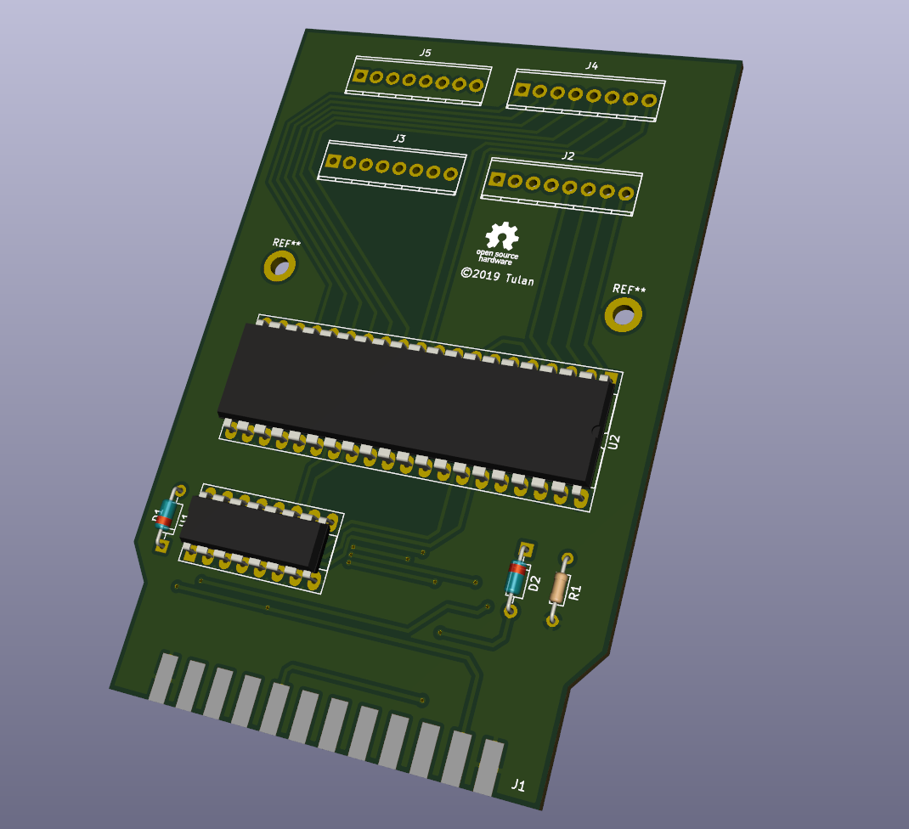

# userport_expander
C64 Userport Expander

The C64 Userport Expander expands the C64 Userport from 8 Bit to 3x8bit.

## Layout and PCB
The whole KiCad project is provided inside subfolder ["kicad"](./kicad).

Please feel free to order your own PCBs, Gerber files are here ["gerber"](./kicad/gerber).

I would be pleased about a small donation: [PAYPAL.ME](https://www.paypal.me/RobertGrasboeck)
